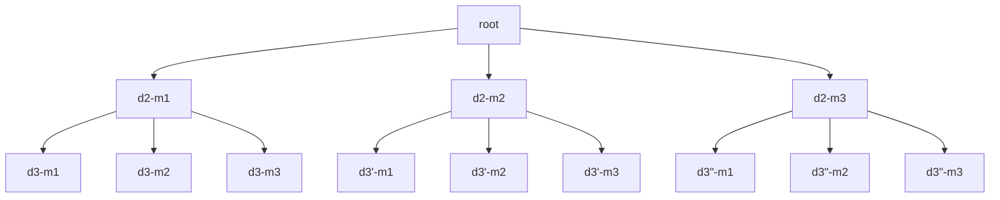
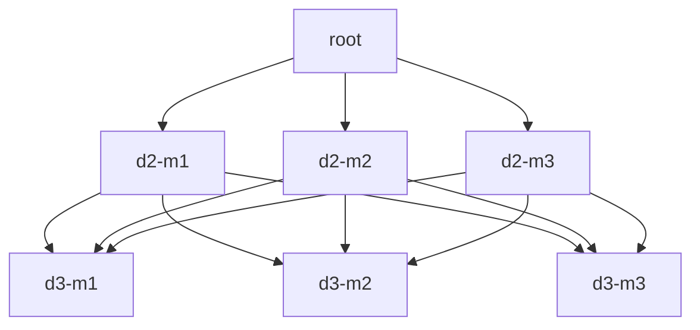

At <a href="https://tabernacle-raleigh.org/" target="_blank">Tabernacle Baptist Church</a> in Raleigh, NC, where I'm an active member, I'm in charge of scheduling people to stand at the entryway and ensure visitors are welcomed and directed to where they need to go.  When I first took on this responsibility I thought it would be trivial since I only needed to schedule one person a week and do my best to not schedule the same person two weeks in a row.

Easy...right?

As you might have guessed already nothing is that simple.  If those had been the only constraints I likely wouldn't be writing this post.  As I started building schedules I quickly realized that people have lives (and other commitments to the church) that would make this less trivial than I initially thought.

There may be scheduling conflicts with other teams, people may be out of town for multiple weeks at a time, or there may be schedules from other teams that don't necessarily conflict with our own but put unnecessary burden on members when they're added to our schedule.  In addition, this isn't something I have to do only once, it will be a revolving commitment so it would benefit me to automate this in some way.  If it's automated, it can be shared with others to ease their burden and feed back the schedules they build into the system for context in future runs.

So, let's dive in and look at the steps I took to build an automated scheduling solution as well as the hurdles I encountered.

## Constraints

Before we look at the process of building an algorithm let's understand our constraints in this problem.  To build a "fair" schedule we will need to adhere to the following:

1. Members will not be scheduled on their "blackout" dates - dates on which they will not be available.
2. Members will not be scheduled in a way that will conflict with other schedules to which they're assigned.
3. Member assignments will be evenly distributed across a schedule.  Assigning a member to a slot becomes more acceptable the further out that slot is from their last assignment.

We'll need to make sure our algorithm accounts for these simultaneously.

## First Attempt
I'll admit my first attempt at a solution was a bit naive.  This was primarily due to time constratints which required me to build some schedules immediately.  It was sufficient for the time but, for reasons I'll explain later, it would not scale well.

I decided to go with a queue-based approach.  The basic algorithm works like this:

1. Iterate over the list of days.
2. For each day, enumerate the list of members checking if each one can be scheduled on the given day.
3. Schedule the first available member and move them to the back of the queue.
4. Loop

```python
# Days populated elsewhere
days = [...]
# Member queue populated elsewhere
queue = [m1, m2, m3]
# Blank schedule
schedule = []

# Iterate over the list of days
for day in days:
    can_schedule = False
    member = None

    # Enumerate the queue checking who can be scheduled
    for idx, tmp_member in enumerate(queue):
        if day in tmp_member["blackouts"]:
            continue

        can_schedule = True
        queue.pop(idx)
        member = tmp_member
        break

    # If no one can be scheduled raise an error
    if not can_schedule:
        raise RuntimeError(f"Failed to schedule anyone for {day}")
    
    # Update the schedule
    schedule.append({"date": day.strftime("%m/%d/%y"), "member": member["name"]})

    # Readd the member to the back of the queue
    queue.append(member)

return schedule
```

This works well and fairly quickly but has some issues that may not be obvious at first glance.  There are some things I'm not showing you for the sake of brevity, such as how the member list is populated.  That may seem insignificant but as I discovered during my testing it matters very much.  Consider the effect our constraints have on the resulting schedule with regard to the order in which we enumerate our member list.  We may end up with an "unfair" schedule due to an assignment we made early on that excluded the member from being scheduled again.  That sounds a bit confusing so let's look at an example.

Assume we have three members `[m1, m2, m3]` and three days `[d1, d2, d3]` to schedule. Assuming no one has any blackouts or conflicts then any permutation of members to days is valid.  However, what if `m2` and `m3` have a blackout on `d2`?  The resulting schedule would be `{d1: m1, d2: m1, d3: m2}`!  Not only would `m1` be scheduled two times in a row but `m3` wouldn't be scheduled at all, breaking two of our constraints.

### Addressing All Permutations
Since it matters which member we start with does it also matter which member is in the second, third, and fourth indexes of the list?  As it turns out, yes.  Each day we schedule is just a subset of the whole problem.  This means we must build a schedule for every permutation of the `members` queue.  We can do this easily in Python with the `permutations` function from `itertools`.

```python
from itertools import permutations

members_lists = list(permutations(["m1", "m2", "m3"]))
for ml in members_lists:
    build_schedule(ml)

## Output
# ('m1', 'm2', 'm3')
# ('m1', 'm3', 'm2')
# ('m2', 'm1', 'm3')
# ('m2', 'm3', 'm1')
# ('m3', 'm1', 'm2')
# ('m3', 'm2', 'm1')
```

Now we can build all possible schedules and pass them to other functions to determine which are the most "fair".  While this solves one problem it introduces another with regard to scalability.

### Scalability Issues
Now that we're building schedules based on all permutations the system has a lot more work to do.  The number of schedules that will be built is `m!` where `m` is the number of members.  This isn't much of an issue until we get to about 9 or 10 members (depending on how many days we need to schedule).  `10!` is `3,628,800`.  That's a lot of schedules to churn through and even a beefy system won't complete it in a reasonable time.  Here is the output of the `time` command when this code is run with 9 members:

```
15.10s user 0.34s system 99% cpu 15.456 total
```

15 seconds is practically an eternity and when running it with 10 members the code never completes.  We need to come up with a better algorithm to speed up the process and allow it to scale.

## Iterate
In computational complexity theory there is a concept known as <a href="https://en.wikipedia.org/wiki/Reduction_(complexity)" target="_blank">reduction</a> in which we can convert a problem with high computational complexity into a well-known problem with low computational complexity.  This also works if you simply don't know how to solve a problem but can figure out a way to frame it as one for which you already have a solution.

Given all of our constraints and the difficulty of building `m!` schedules, what if we just reduced this to a <a href="https://en.wikipedia.org/wiki/Graph_traversal" target="_blank">graph traversal</a> problem?  Then we could represent all possible schedules in the graph and just follow the path from `root` to `goal` for the most efficient (or "fair") path.  By reducing the problem to a graph we also get some other benefits such as the ability to <a href="https://en.wikipedia.org/wiki/Memoization" target="_blank">memoize</a> solved structures and prune inefficient paths.

Let's take a look at our earlier example with three members and three days.  Here is a graph that represents all possible permutations given a single member to start as our root node.  We would need to build `m` graphs starting with each member in the list.



Searching the graph with our eyes we can see there are exactly two paths we would consider to be "fair" for any given `root` node.  e.g. if `root` is `m1` then the fairest paths are `[root] -> [d2-m2] -> [d3'-m3]` and `[root] -> [d2-m3] -> [d3"-m2]`.  But there are nine possible solutions which means there are seven we shouldn't waste our time processing if we can help it.

Talking about wasted time, the search space is growing rapidly.  In fact, you may have noticed there are more than `m!` solutions in this graph.  The total number of nodes in the graph which we would potentially visit is represented by the equation below where `d` is the depth (or number of days) and `m` is the number of members.

$$
\LARGE m*\sum_{x=0}^{d}m^x
$$

If we were to run the algorithm across the entire graph we'll find it actually performs *worse* than our queue-based approach.  Fortunately, there are some things we can do to limit the search space which we'll talk about in [Traversing the Graph](#traversing-the-graph).  Before we can do that we first have to build the graph.

### Building the Graph
If we're not careful, building our graph could take so long that we'll terminate our program before it even begins searching.  If we build it node-by-node without optimizations we'll run into the same scalability issues we had with the queue-based approach.  To avoid these problems we're going to use <a href="https://en.wikipedia.org/wiki/Memoization" target="_blank">memoization</a> to prevent rebuilding sub-trees that have already been built.  The graph below shows how memoization can help us:



Notice that we have all the same paths as the previous graph but fewer nodes.  As we add more members and days to the input this approach will keep the work required to build the graph to a minimum.  See the code below for a recursive function that builds this graph.  Don't worry about the custom classes used here; an `Entry` is just a node in the graph and a `Person` represents a member.

```python
def populate_graph_r(
    people: list, person: Person, days: list, day: datetime, ref_time: dict
) -> Entry:
    day_pos = days.index(day)

    # Lookup in cache
    if (day, person) in memoize_cache:
        return memoize_cache[(day, person)]
    
    # If the person cannot be scheduled on the current day
    # there is no need to build the tree further
    if not person.can_schedule(day, ref_time):
        return None

    # Create a new Entry (node) and add the
    # person to it.
    entry = Entry(day)
    entry.person = person
    entry.depth = day_pos + 1

    # Check if we are on the last day in the list
    if day_pos + 1 < len(days):
        # For each person, recurse to the next day
        for _p in people:
            # Recurse and continue building the graph
            next_entry = populate_graph_r(people, _p, days, days[day_pos + 1], ref_time)

            # If the child node could not be established
            # then skip it. Otherwise, append it to the
            # current node's list of children.
            if next_entry:
                entry.next.append(next_entry)
    else:
        # Mark this entry as a leaf node meaning there
        # are no children nodes beneath it
        entry.leaf = True

    # Memoize the entry so it can be
    # referenced later
    memoize_cache[(day, person)] = entry

    # Return the entry
    return entry
```

Our `memoize_cache` is a simple `dict` that we use to store the `entry` for a `day` (depth) and `person` (member).  Notice at line 7 how we first perform a lookup to see if a node has already been computed and, if found, is returned before doing any real work.  Assume this node is `d3-m2` from our graph above.  Where previously we would have built it 3 times we now have built it only once and simply pointed to it the other two times.  Also, remember our equation above that states we build `m` number of graphs?  To offset this we maintain our cache across graph builds since the subtrees will be the same.  This is a significant optimization with regard to speed and storage.

### Calculating "Fairness"
We need a way to express fairness so our traversal algorithm can make decisions according to our list of constraints.  This can be done via a cost associated with each node.  Our algorithm will look at the cost of each node, as well as its children, and make a decision on which path to travel.  So let's define this cost.

- The base cost to travel to a node is `1` in addition to the cost of its parent.  i.e. the cost of a node is its total cost from `root`.
- The cost should be adjusted proportionally to the frequency with which the member has been scheduled thus far.  We'll call this `visibility` and associate a higher cost with high visibility and lower cost with low visiblity.
- The max value for cost will be pinned to `m` (the number of members).

We might be tempted to store this cost with each node when we build the graph to make traversal easier.  However, this will break our memoization optimization as we need different cost values based on which path has led us to a node.  Instead, we'll build an overlay graph as we traverse the original.  This overlay will consist of traversal nodes (or `tNode`) that track visibility of all members as well as the node's cost.  At each depth, the visibility will be updated by the following function:

```python
def update_visibility(ref: dict, entry: str) -> None:
    """
    Sets the visibility to the max for
    the provided entry and decrements
    all others by one
    """
    for key in ref:
        ref[key] = ref[key] - 1 if ref[key] > 0 else 0
    ref[entry] = configs["NUM_MEMBERS"]
```

Now that we have a way to determine a "fair" path lets put it to use in the last piece of our puzzle...traversal.

### Traversing the Graph
At this point all of the hard work has been done.  All that's left is to hop from node to node traveling down the cheapest path.  But how do we know which path will be the cheapest?  What if the cheapest path at depth 3 leads to a more expensive path overall by depth 10?  Our traversal algorithm will need a <a href="https://en.wikipedia.org/wiki/Heuristic_(computer_science)" target="_blank">heuristic</a> to help guide it to an optimal path.  Our heuristic is simple:

$$
\large min(childCost + (maxDepth - childDepth), lowestCost)
$$

In English, if the least potential cost from the current node to a leaf node is not lower than our current best path then we have no reason to travel down it.  This will ensure that our search gets more efficient as it progresses.

Here it is in code:
```python
# Build a heuristic based on the cost from root to this node and
# how many nodes we have to go until we hit a leaf
heuristic = child_cost + (configs["NUM_DAYS"] - child.depth)
if heuristic < configs["LOWEST_COST"]:
    child_tnodes.append((child_cost, child_tnode))
```

We'll also be sure to only identify goal nodes as those that have the lowest cost.  If we find a cheaper path to a leaf node we will throw out our previous goal nodes and start fresh.  Here's how we'll do that:

```python
if tnode.node.leaf:
    if tnode.cost < configs["LOWEST_COST"]:
        configs["LOWEST_COST"] = tnode.cost
        goals = []
    if tnode.cost == configs["LOWEST_COST"]:
        goals.append(tnode)
```

Putting it all together we get our `traverse()` function below:

```python
def traverse(entry):
    if not entry:
        return []
    
    unvisited = []
    goals = []
    heapq.heappush(
        unvisited,
        (0, tNode(1, entry, None, {entry.person.name: configs["NUM_MEMBERS"]})),
    )

    while unvisited:
        _, tnode = heapq.heappop(unvisited)

        if tnode.node.leaf:
            if tnode.cost < configs["LOWEST_COST"]:
                configs["LOWEST_COST"] = tnode.cost
                goals = []
            if tnode.cost == configs["LOWEST_COST"]:
                goals.append(tnode)
        else:
            child_tnodes = []
            for child in tnode.node.next:
                # Build a child tNode
                child_tnode = tNode(0, child, tnode, tnode.visibility.copy())

                # Calculate the cost based on the visibility
                child_cost = child_tnode.visibility.get(child.person.name, 1)
                child_tnode.cost = tnode.cost + child_cost

                # Increase the visibility of the current node
                update_visibility(child_tnode.visibility, child.person.name)

                # Build a heuristic based on the cost from root to this node and
                # how many nodes we have to go until we hit a leaf
                heuristic = child_cost + (configs["NUM_DAYS"] - child.depth)
                if heuristic < configs["LOWEST_COST"]:
                    child_tnodes.append((child_cost, child_tnode))
            
            # Push the nodes with the least cost to the heap queue
            for c in child_tnodes:
                if c[0] == min(child_tnodes)[0]:
                    heapq.heappush(unvisited, c)
    return goals
```

Since we can have multiple optimal paths of equal cost, this function will return all of them.  Even better, look at the result of our `time` function:


## Conclusion
